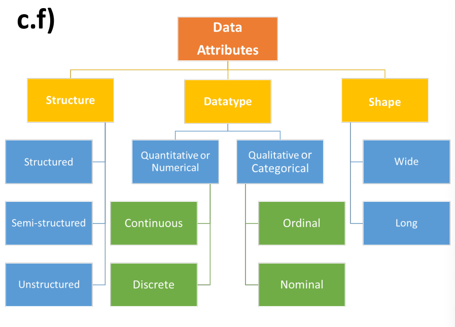
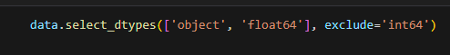
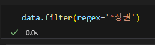

# Data Structure
	- 
	- data = 수치 데이터
	- 구조에 따라서 분류가 가능하다
	- 대표적으로 db가 데이터를 구조에 따라서 분류한다
	- 정형 데이터 = structured data (DB의 Column과 같은)
		- 데이터 자체가 의미를 갖고 있기에 순서를 바꿔도 의미가 존재해야 정형 데이터다
	- ### 나쁜 데이터 (Dirty Data)
		- **현실 세상의 data는 messy**
		- ex) 값 잘못 입력, 부식, 표준 아닌 값, 무응답, 중복, 일치하지 않는, 쓸데 없는 데이터 ...
	- ### Pandas
		- pandas를 통해 dirty data를 찾고 고칠 것이다
		- structued array + masked array = pandas
		- GIGO (Garbage in, Garbage out)
			- 나쁜 데이터가 들어오면 나쁜 결과가 나온다
		- 따라서, 데이터를 정제해야한다
		- R에서 많이 가져옴
		- SQL에서도 많이 가져옴
		- Excel에서도 많이 가져옴
		- 최적화된 속도로 프로그래밍을 할 수 있다는 장점이 있다
	- ### Error의 이유
		- 데이터를 검수하여 원인을 찾는다 (진단)
		- 보통 사람이 실수를 많이 한다
		- 기계도 실수를 한다
			- 외부 요인으로 인해 실수가 생길 수 있다
			- 하지만 일정해서 고칠 수 있다
	- ### Detecting Error
		- 잘못된 데이터를 막아야한다
		- domain knowledge가 필요하다
		- JSON의 문제점: data type이 없다 / scheme이 없다
		- 알고리즘을 통해서 잘못 되었음을 알 수 있다
			- Scheme을 이용하거나 함수로 detect할 수 있다
		- CUE? 언어
			- validation (데이터가 잘못됐는지 아닌지 처리하는데 최적화된 언어)
		- Pydantic
			- FASTapi에서 validation으로 Pydantic을 사용함
			- annotation을 좀 더 향상된 방법으로 만든 것
		- Marshmallow
			- 데이터 주고 받을때 체크하는 얘
		- Pandera
			- pandas를 확장시켜 validation할 때 사용한다
	- ### Preventing Error
		- 텍스트 형태로 수집 시 문제 존재: 텍스트를 불러오면 string으로 오기 때문에 type으로 validation이 안된다
		- 따라서, structured 되어 있는 db에서 validation이 가능하다
		- 어떻게 처리?
			- 파일 포맷 정하는 것
			- 예를 들어 csv, excel 등
			- 하지만 JSON, csv 다 데이터 타입의 문제가 존재한다
		- pandas에서 역할을 분리할지 (파일 타입에서) 정하는데 csv.. 이런 것들은 못함 따라서 SQL을 사용
		- serialization type => 어떤 파일 타입 선택할지 정하는 것
		- 크면 read_sql로 불러온다 (performance 향상, 데이터가 많을때)
		- **pd.read_parquet**
			- 데이터 수집 자동화 / arrow도 같이 사용해야함
		- Digital Signature
			- 파일 크기와 fingerprint를 사용하여 파일 다운 시 확인하여 잘못됐는지 아닌지 방지하기 위해 사용함
		- 수집을 ELT 방법으로 많이 사용한다
		- **apache airflow**
			- pipeline을 만들어준다
			- 자동화 시켜준다 = 실수가 나도 훨씬 더 편하게 실수를 잡을 수 있다
		- **Invoke**
			- 자동화 / decorator로 강제성 부여
		- Tidy Data?
			- Narraow Data = Long form = Tidy Data
			- 목적: 깨끗한 데이터를 수집하기 위해 필요한 lib 모아놓은 애
		- error를 결정하기 위한 기준을 정해주는 애들이 있다
	- ### Fixing Error
		- pd.read_csv => data.info (데이터의 info를 보여준다 / 64형태로 불러옴)
		- dask => 여러개의 컴퓨터에서 처리 가능하게 만들어줌
		- data.dtypes => 자동으로 어떤 값이 어떤 type인지 불러옴 (엉터리로 불러올 수도 있음)
		- data가 많으므로 일부만 보자
			- 앞에서 순서대로 보자 **data.head()**
			- 뒤에서부터 보자 **data.tail()**
			- 랜덤하게 보자 **data.sample()**
				- %로 뽑을 수 있고
				- 섞을지 안섞을지 결정 가능
				- data를 불러와서 확인하는 단계
			- #### indexing과 slicing으로 잘못된 것을 찝어보자
				- fancy, record, 등 numpy에서 사용하는 indexing 기법들을 사용 가능하다
				- dtype으로 data를 include할 수도 exclude할 수도 있다
				- 
			- 원하는 것만 뽑는 것
				- re 사용
				- data.filter(regex = '')
				- 
				- data.filter(like='') => 원하는 애들 뽑는 것 가능함 like 기능 사용
			- indexing과 slicing은 **iloc**와 **loc** 그리고 **콤마(,)** (= 영역 / sepal_length, sepal_width 등), **iat**는 선택하여 뽑는 방법
			- 다 numpy의 comma indexing에서 보는것
		- 에러를 잡기 위해선?
			- 이름 변경 (size가 우리가 원하는 matrix size가 아니라 elements 개수가 나오는 예시와 비슷)
			  logseq.order-list-type:: number
			- logseq.order-list-type:: number
	- ### 단계
		- 데이터 수집
		  logseq.order-list-type:: number
		- raw 데이터에 어떤 의미가 있는지 발견해야함
		  logseq.order-list-type:: number
		- 데이터 정제 (data wrangling)
		  logseq.order-list-type:: number
			- 비정형은 규칙에 맞지 않아도 어느정도 해결이 되는 경우가 있다
			  logseq.order-list-type:: number
		- 바뀐 데이터가 어떤 의미를 가지는지 확인해야함
		  logseq.order-list-type:: number