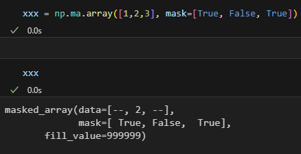

# Knowledge
	- ### elementwise
		- 각 계산을 한번에 실행함 / element별로 계산함
		- 숫자가 클 때 유리하다
	- ### Numpy
		- numpy는 mutable이다
			- 그래서 copy를 사용한다
			- np.copy는 default가 deep copy다
			- 이때의 copy는 **deep copy**이다
			- np.view 는 default가 **shallow copy**다
			- 사용 시기는 **원본 데이터를 지키고 싶을때 np.copy**
			-
		- copy의 종류가 여러개가 존재한다
			- **deep copy** = value만 copy
			- **shallow copy** = address copy
			- python 기본 copy는 shallow copy이다
			- copy에서 deecopy를 사용하면 deep copy다
	- ### 차원의 확장
		- 
		- 여기서 [:, :, None] 에서 [..., None]으로 써도 된다
		- 사용하기 힘들기에 np.newaxis로 새로운 좌표축 생성이 가능하다
		- 즉, 차원의 확장이 가능하다
		- 
	- ### Homogeneous의 확대
		- 원래 a = ['a', 1, 2]는 호모가 아니다
		- 하지만 b = ['b', 2, 3]을 만들면 a,b 둘다 **호모이다**
	- ### Structured Array
		- **namedtuple**
			- C의 struct와 비슷하다
			- {:height 502, :width 379}
			- np.array로도 만들 수 있다
			- 
		- 이것을 확장한게 **rec.array**이다
			- 얘는 .name 이런 dot notation으로도 접근 가능하다
			- 
		- **mask array (ma.array)**
			- 특정 값을 가릴 수 있음
			- 여기서 count가 가능하다 (안가려진 애들)
			- missing data (비어있는 데이터)를 보고 싶을때 사용
			- 
		- **Matrix array (np.matrix)**
			- repr이 array가 아니라 matrix이다
			- 이때 matrix의 성질을 그대로 따라간다
			- * 연산은 element의 곱이 아니라 matrix 곱으로 간다
			- 
			-