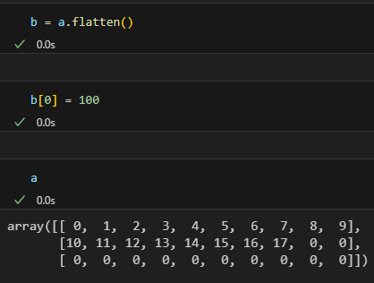

- 
- 수학적 연산을 기본으로 만든 것이 아님
- Array보다 빠르지만 hardware 성능 활용
- vectorized - vector처럼 연산한다
	- CPU 기반 병렬 계산
- 본래의 Python list의 문제점
	- C와 다르게 연속으로 값을 배치시키지 않았음
	- 오히려 linked-list 타입이다
- tensor와 똑같이 만들어진
- list to numpy 가능하
- **np.ndarray**
	- nd - n dimension
	- 3차원 이상을 tensor라고 한다
	- array = data type / vector = 수학적 의미
	- \_\_array\_\_ 있으면 numpy랑 연동이 가능하다
- **np.array()**
	- couorse로 인해 element 개수가 다르거나, type이 달라도 알아서 만들어준다
- **np.arange()**
	- range와 같은 기능이다
	- 만약 4를 넣게 되면 [0,1,2,3]의 array가 생성된다
- **np.zeros()**
	- 0으로 채우는 함수
	- ``np.zeros((4,4), dtype=float)``
	- 결과로는 4x4의 matrix이며 모든 값은 0이 된다
- **np.ones()**
	- zeros와 비슷하게 1로 채우는 함수를 의미함
	- ``np.ones((4,4), dtype=float)``
- **np.ones_like()**
	- matrix만큼 1로 채워진 같은 사이즈의 행렬을 만듦
	- 
- **np.triu() / np.tril()**
	- upper matrix / argument에는 (3,4)라 하면
	- 
- **np.identity()**
	- identity 만드는 것
	- nxm 넣어주면 됨
- **np.eye()**
	- 행, 열로 argument 넣어줌
	- 
- **np.random**
	- np.ranom.randint()
		- 1st arg - start point
		- 2nd arg - end point
		- 3rd arg - matrix size
		- ``np.random.randint(0, 19, (3,3))``
		- \[[2 3 8] [7 0 7] [7 5 6]]
	- np.random.normal()
		- 1st arg - 평균
		- 2nd arg - 표준편차
		- 3rd arg - matrix size
		- ``np.random.normal(0, 1, (3,3))``
		- 3x3인 평균과 표준편차 값을 가지는 array가 나옴
- **np.concatenate()**
	- 두 개의 array를 일렬로 합친다
	- [1,2,3] + [3,4,5] = [1,2,3,3,4,5]
	- ``np.concatenate([array1, array2])``
	- axis option = 차원을 만들어줌
	- ```
	  array1 = np.arange(4).reshape(1,4)
	  array2 = np.arange(8).reshape(2,4)
	  array3 = np.concatenate([array1, array2], axis=0)
	  >>>
	  [[0 1 2 3]
	   [0 1 2 3]
	   [4 5 6 7]]
	  ```
- **np.split()**
	- params: matrix, (nxm), axis
		- axis = 1 수평으로 분할
		- axis = 0 수직으로 분할
		- (nxm) = 위치의 원소를 가지는 배열로 분할
			- ex) (2,4) -> x[:0:2], x[:2:4], x[:4:6]
			- 
	- params: matrix, num, axis
		- axis는 동일
		- num = 몇개로 분할할지 정함
		- 
	- params: matrix, [num], axis
		- axis는 동일
		- [num] = num 만큼 slicing 함 ([:num])
		- 
- **np.save()**
	- params = filename, array
	- array를 filename으로 저장한다
	- 확장자는 .npy이다
	- 불러올때는 **np.load(filename)**를 통해 불러올 수 있다
- **np.savez()**
	- 여러개의 array를 하나의 file로 저장 가능
	- 확장자 명은 .npz이다
	- ```
	  data = np.savez('saved.npz', array1=arr1, array2=arr2)
	  data['array1']
	  data['array2']
	  ```
- **np.sort()**
	- params = arrays, axis
	- axis = 0 열을 기준으로 정렬
	- 
	- axis = 1 행을 기준으로 정렬
	- {:height 193, :width 505}
	- Numpy 원소를 정렬해준다
	- ```
	  # a가 numpy array일때
	  t1 = np.sort(a) # returns array a
	  # 이때는 t1에 sorted array를 저장
	  # a는 바뀌지 않는다
	  # 혹은
	  a.sort() # a 자체를 바꿔버린다
	  ```
- **np.linspace()**
	- params = start, endpoint, space
	- 0부터 10까지 space 개수만큼 생성
	- 
- **np.random.seed()**
	- params = num
	- 난수를 생성한다
	- random 시 나오는 값들을 고정시켜준다
	- 즉, seed가 리셋되지 않으면 random 시에 매번 다른 수가 나온다
	- 반대로 말하면 seed가 달라지면 rand는 계속해서 다른 수가 나온다
	- 
- **np.lookfor(), np.info()**
	- Helping method
- **a.copy()**
	- Numpy 배열 객체를 복사한다
	- copy 시에는 서로 다른 memory address를 가진다
- **np.unique()**
	- 중복된 원소를 제거해준다
	- ex) ``np.unique(array1)``
- **np.reshape()**
	- 형태를 바꾼다
	- ```
	  array1 = np.array([1,2,3,4])
	  array2 = array1.reshape((2,2))
	  ```
	- \[[1,2][3,4]]
	- *이때 array2를 바꾸면 array1 또한 바뀐다*
	- 
	- np.shape()로 넣을 시에는 size를 꼭 괄호 안에 넣어서 주어야 한다
	- 
	- shape를 바꾸려면 element 개수가 같게해야한다
	- (3,-1) - shape을 기본으로 준다
	- 
	- 이때 모든 minus 값은 똑같은 기능을 하며 음수 값은 하나만 넣을 수 있다
- **np.resize()**
	- 자기 자신이 바뀐다
	- elements의 개수를 바꿀 수 있다
	- 
	- 더 크게 키우면 0으로 채워준다
	- 
- **a.flatten()**
	- 배열을 1차원으로 만들어준다
	- 내장으로 copy tech가 존재한다
	- 즉, address값을 받는 것이 아니다
	- 
	- 
- **a.ravel()**
	- copy tech가 아니다
	- address를 return함과 동시에 1차원으로 펴준다
	- 
- **shape**
	- matrix의 크기를 return 한다
- **ndim**
	- matrix의 차원을 알려준다
- **dtype**
	- data type을 알려줌
- tensorflow 에서 unpacking
	- len으로 몇개 있는지 확인 후 unpack
	- x,y = tf.~
- **size**
	- 원소의 개수
	- shape에서 나오는 값들로도 충분히 알 수 있음
- **itemsize**
	- bit를 byte로 표현하는 것
- **data**
	- numpy에서는 일렬로 저장하기 때문에 memory 값이 나옴
	- stride 라는 개념이 나옴
	- stride tree 개념
- **꼼수**
	- 세상의 모든 것을 2차원으로 생각해라
	- shape를 3,2,4로 하면 중간의 빈 선으로 나누고 2차원으로 해석한다
- code: [numpy_1.ipynb](../assets/numpy_1_1710752124614_0.ipynb)
-