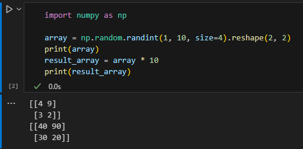
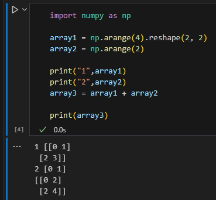
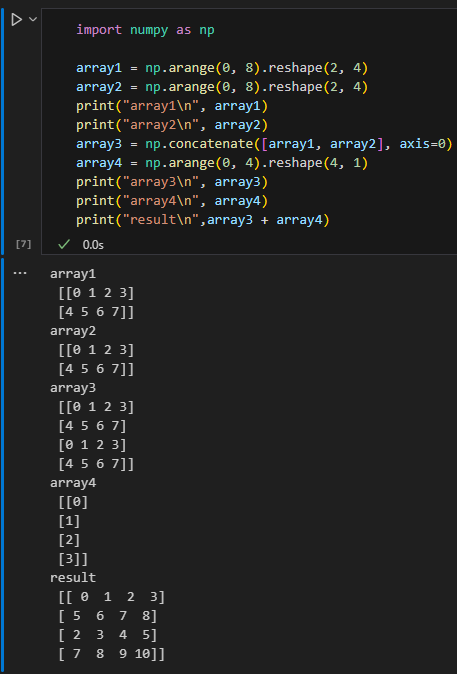
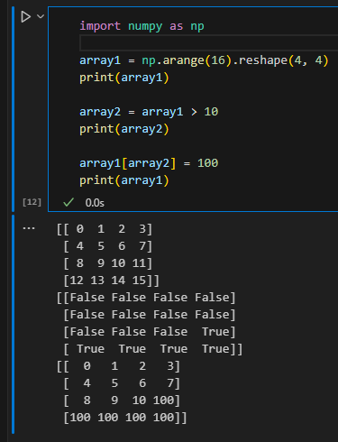
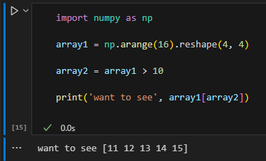
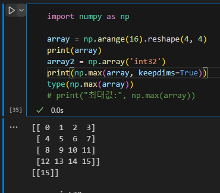
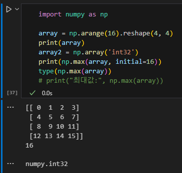
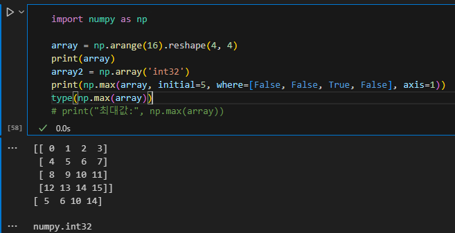

# 연산과 함수
	- ## Scalar 곱
		- array * 10 => 전체 element에 10을 곱함
		- 
	- ## Matrix 합
		- array1 + array2 => matrix 합과 같음
		- '
		- 
		- 서로 다른 형태의 Numpy 연산도 가능하다
		- 이유는 **브로드캐스트**이다
			- 브로드캐스트 = 형태가 다른 배열을 연산할 수 있도록 배열의 형태를 동적으로 변환
			- 브로드캐스트 조건
				- 차원의 크기가 1일때 가능하다
				  logseq.order-list-type:: number
				- 차원의 짝이 맞을 때 가능하다 = 차원에 대해 축의 길이가 동일하면 가능
				  logseq.order-list-type:: number
				- 
				  logseq.order-list-type:: number
	- ## Masking
		- 각 원소에 대하여 값을 바꾸거나 체크함
		- **반복문보다 빠르다**
		- 
		- array1[array2] = 100
			- array2로 mask한 부분들은 (True) 100으로 값을 바꾸겠다는 의미이다
			- 이때, array2는 array1에서 조건에 해당하는 값을 기억한다
			- 
	- ## 집계함수
		- params = axis, dtype, out, keepdims, initial, where
			- axis = 각 열(0), 행(1)의 최소 값을 구하게 할 수 있음
			- dtype = 반환할 type / int32, float32, float64, etc.
			- out = 모르겠다
			- keepdims = dimension을 맞춰서 출력할지 정함, True or False
				- 
			- initial = 결과로 나올 값의 최소값 설정
				- 
			- where = 모르겠다
				- 
		- np.max()
			- array 내에서 가장 큰 값을 출력
		- np.min()
			- array 내에서 가장 작은 값 출력
		- np.sum()
			- array 모든 값을 더한 결과 출력
		- np.mean()
			- array 모든 값들의 평균 출력
			- initial, where 없음
-