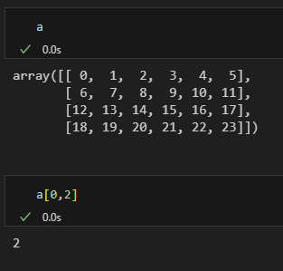
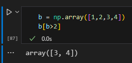
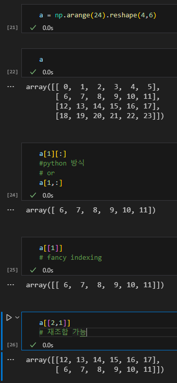
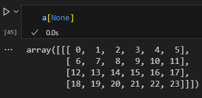

# 연산과 함수
	- ## Scalar 곱
		- array * 10 => 전체 element에 10을 곱함
		- 
	- ## Matrix 합
		- array1 + array2 => matrix 합과 같음
		- '
		- 
		- 서로 다른 형태의 Numpy 연산도 가능하다
		- ### 이유는 **브로드캐스트**이다
			- 브로드캐스트 = 형태가 다른 배열을 연산할 수 있도록 배열의 형태를 동적으로 변환
			- 브로드캐스트 조건
				- 차원의 크기가 1일때 가능하다
				  logseq.order-list-type:: number
				- 차원의 짝이 맞을 때 가능하다 = 차원에 대해 축의 길이가 동일하면 가능
				  logseq.order-list-type:: number
				- 
				  logseq.order-list-type:: number
	- ## Masking
		- 각 원소에 대하여 값을 바꾸거나 체크함
		- **반복문보다 빠르다**
		- 
		- array1[array2] = 100
			- array2로 mask한 부분들은 (True) 100으로 값을 바꾸겠다는 의미이다
			- 이때, array2는 array1에서 조건에 해당하는 값을 기억한다
			- 
	- ## 집계함수
		- params = axis, dtype, out, keepdims, initial, where
			- axis = 각 열(0), 행(1)의 최소 값을 구하게 할 수 있음
			- dtype = 반환할 type / int32, float32, float64, etc.
			- out = return할 matrix의 size
			- keepdims = dimension을 맞춰서 출력할지 정함, True or False
				- 
			- initial = 결과로 나올 값의 최소값 설정
				- 
			- where = boolean 조건에 부합하는 애들만, 마찬가지로 size가 맞아야함
				- 
		- np.max()
			- array 내에서 가장 큰 값을 출력
		- np.min()
			- array 내에서 가장 작은 값 출력
		- np.sum()
			- array 모든 값을 더한 결과 출력
		- np.mean()
			- array 모든 값들의 평균 출력
			- initial, where 없음
	- ## 내적, 외적
		- np.dot(array1, array2)
			- 각각 곱한 것을 곱해서 더하는 것
			- a@b로 표기할 수 있다
			- 즉, decorator를 연산자로 쓸 수 있게 해주었다
			- 2차원일 때는 행렬의 곱으로 사용됨
	- ## Indexing & Slicing
		- 2차원에서 특정 값을 뽑고싶을 때, 좌표값으로 indexing이 가능하다
		- Comma indexing
			- 
		- Boolean indexing
			- 
			- True인 애만 return한다
		- Fancy indexing
			- 
			- dictionary의 np에서는 key값 두개를 바꿔서 넣어도 사용 가능하다
		- 그 외에 **[][] 두개의 indexing**
		- 또 다른 하나는 **comma indexing** (1,2)
	- ## 차원 확장
		- **a[None]**
		- 
	- ## Universal Functions
		- python의 data type과 유연하게 사용 가능한 방법
		- dir 안의 \_\_array_ufunc\_\_이 있으면 사용 가능하다
		-