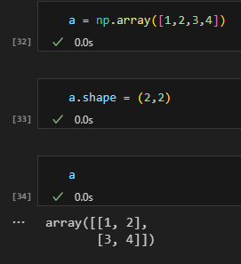
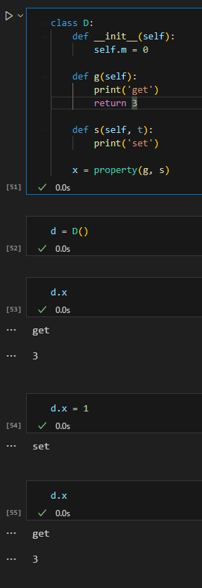
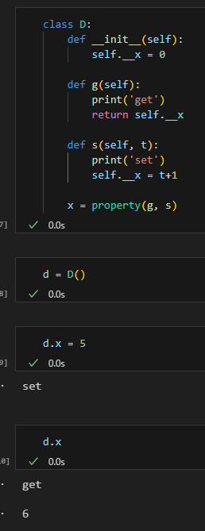
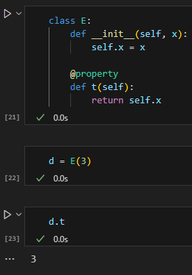
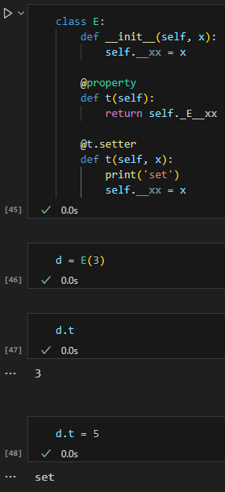

# Encapsulation
	- **값 못바꾸게 만들기**
		- ```
		  class A:
		  	__x = 1
		  
		  # _A__x로 접근 가능하다
		  ```
		- 이것을 encapsulation (mangling) 이라고 함
	- Descriptor
		- 예시)
		- ```
		  class B:
		  	def __get__(self, a, b):
		      	print('get')
		     	def __set__(self, x):
		      	print('set')
		     
		  class C:
		  	bb = B()
		      def __init__(self):
		      	self.b = B()
		          
		  C.bb	# get 함수 실행
		  c = C()
		  c.bb = 2	# set 함수 실행
		  ```
		- Composition의 일환
		- Descriptor = . 을 사용하여 어떤것을 실행시킬지 정하는 것
			- 따로 문법이 존재한다
			- 자기 자신을 변환시킬 수 있다
			- 비슷한 의미로 **numpy의 a.shape** 또한 비슷하게 흘러간다
			- 
			- 즉, set과 get을 따로 함수를 만들어 놓으면 dot attribute 혹은 = 로 바꾸고 싶을 때 다른 기능을 수행할 수 있다
			- Old version과 New version이 존재
			- 
			- return 3이 없으면 정보 은닉이 가능하다
			- property라는 함수를 사용하여 구현 가능
			- 
			- Decorator Property
				- @property가 붙어서 callable에서 callable이 안되는 것으로 바뀌었다
				- 
				- 이때 __instance와 set을 같이 사용하고 싶으면
				- 
	- **repr() vs str()**
		- repr - 특수문자 escape 처리하지 않고 나옴
		- 부를때는 a
		- str - 특수문자 escape 처리
		- 부를때는 print(a)
	- **readline vs next**
		- readline은 stop iteration이 존재함
		- next는 존재하지 않음
	-