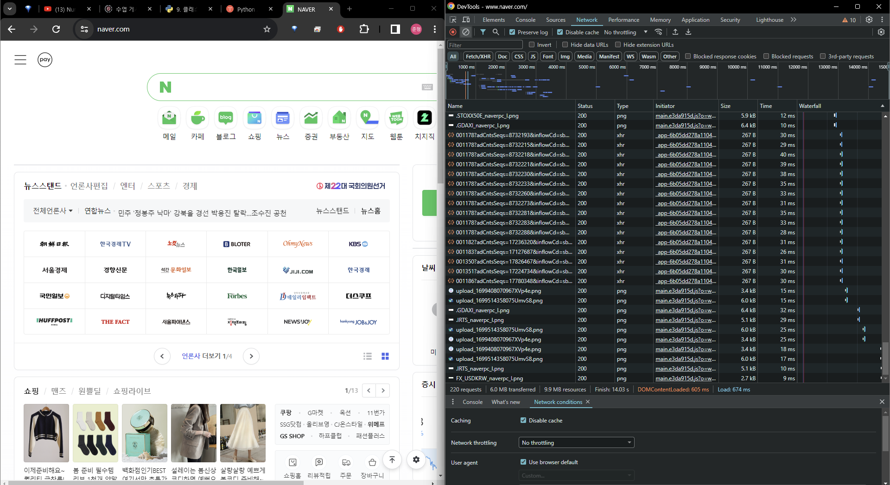
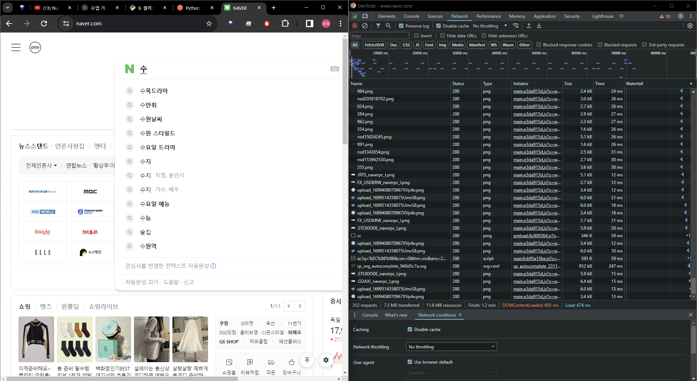
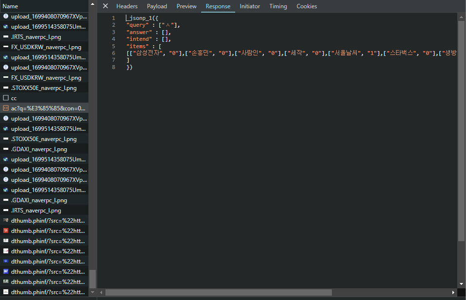
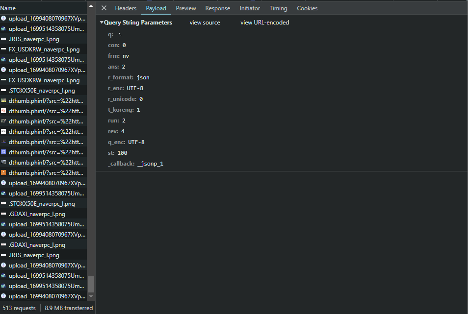
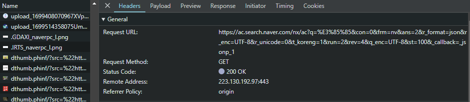

# Overview
collapsed:: true
	- crawling
		- 전체 html 파일 필요
		- large scale
	- scrapping
		- 특정 url에서 원하는 부분만 추출 가능
		- focused - large scale 끝없이 나옴
- # JS or JQuery
  collapsed:: true
	- 대부분의 메인 웹사이트들은 데이터를 모두 HTML에 올리지 않는다
	- 이때, 개발자 도구에서 network로 이동해 어떤 JS 혹은 JQuery가 움직이는지 확인해야한다
	- RESTful 함수들은 GET의 경우 주소와 파라미터 값을 통해 데이터가 움직이기 때문이다
	- code를 통해 알아보자
	- 해당 코드는 검색 창에서 추천으로 뜨는 단어들을 받길 원할 때 이다
	- ## [scrap_prac.ipynb](../assets/scrap_prac_1710854649417_0.ipynb)
	- 
	- **본래의 개발자 도구**
	- 
	- 개발자 도구의 ac 파일이 새롭게 올라온 것이 보인다
		- 본래는 새롭게 불러온 파일들을 열어서 data를 봐야한
	- 
	- 위의 개발자 도구의 Response를 보면 내가 보려는 data의 값이 맞는지 확인 가능하다
	- 
	- Payload 를 보면 어떤 params를 넣어야 하는지 알 수 있다
		- _call_back은 다른 함수에 들어가도록 만들어주는 param이다
		- 이미 r_format으로 json임을 알려줬기에 _call_back이 없어도 json 형태로 잘 나온다
		- ### [[JSON]]
	- {:height 171, :width 748}
	- Headers를 보면 어떤 URL을 통해서 받는지 알 수 있다
- # Login
	- asd
- # Examples
	- 3.19
		- [scrap_prac.ipynb](../assets/scrap_prac_1710865009343_0.ipynb)
		-