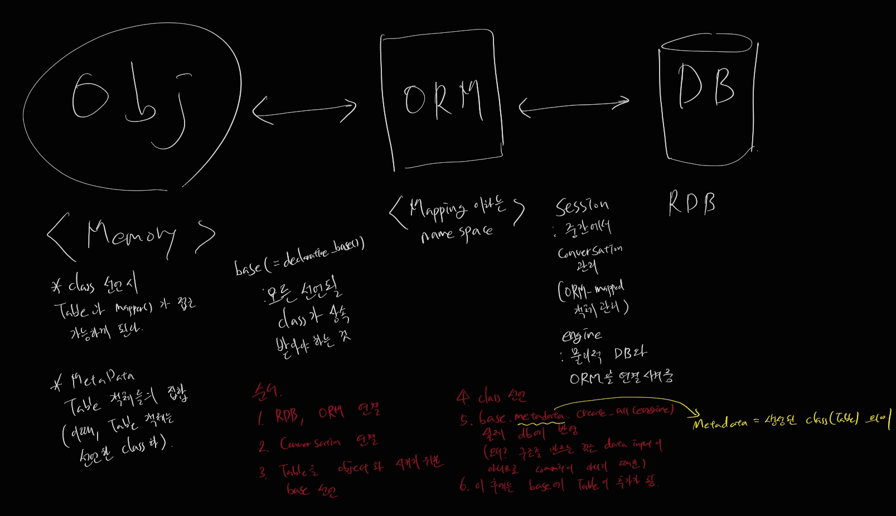

- ORM
	- # base
	  collapsed:: true
		- ```
		  from sqlalchemy.ext.declarative import declarative_base
		  base = declarative_base()
		  ```
		- 어플리케이션은 일반적으로 가져온 데이터베이스의 인스턴스 하나만을 가진다
		- 따라서 base를 상속해야하는 모든 클래스들에 상속하여 사용해야한다
		- **base.metadata.tables**
			- ORM의 table 객체를 의미하며 보여준다, attribute도 보여줌
		- **base.metadata.create_all()**
			- argument에는 engine이 들어가야함
			- table 객체를 sql문으로 해석하여 생성하는 역할
			- db에 반영시키는 구문
		- **base.registry.dispose()**
			- 등록된 base를 날림
			- class를 날리지만 table 객체는 살아있다
			- 따라서, table 객체에서 불러오는 것이 가능하다
	- # engine
	  collapsed:: true
		- ```
		  from sqlalchemy.engine import create_engine
		  engine = create_engine('sqlite:///:memory:', echo=True)
		  ```
		- orm에서 사용되는 engine을 declare 하기 위해 필수적이다
		- echo 옵션의 경우 히스토리를 보고 싶으면 True로 설정해놓으면 된다
		- **engine.dispose()**
			- engine을 초기화한다
	- # session
	  collapsed:: true
		- ```
		  from sqlalchemy.orm import sessionmaker
		  session = sessionmaker(engine)
		  sess = session()
		  ```
		- session은 **db와의 대화를 설정하고 모든 객체를 나타낸다**
		- 즉, ORM 객체의 지속적인 작업을 관리한다
		- sessionmaker = session 객체 생성
		- **sess.add()**
			- argument로는 instance화한 class가 들어간다
			- class의 instance를 session에 등록한다
		- **sess.commit()**
			- session에 저장된 기록들을 commit한다
		- **sess.dirty**
			- 무언가 변화했을 때, dirty라고 인식한다
			- 만약 비어있다면 변화가 없다는 뜻
		- **sess.ismodified()**
			- argument로 instance화한 class가 들어간다
			- 특정 개체가 어떻게 되었는지 (바뀌었는지) 확인하게 해준다
		- **sess.query()**
			- argument로 table 이름이 들어간다
			- ```
			  sess.query(User).all()
			  ```
			- 전체 데이터를 가져오며 indexing이 가능하다
			- filter 등의 함수 적용도 가능하다
			- 또한 해당 index는 instance로써 들어가있으므로 instance와 비교 가능하다
			- __sess.query().one().TABLENAME.append()__
				- ```
				  a = sess.query(Artist).one()
				  a.albums.append(Album(name='가수1의 앨범1'))
				  ```
				- 이런식으로 append가 가능하다
				- 이때 a는 artist에서 가져오는 instance 하나를 의미한다
				- a.albums는 relationship으로 정의된 album을 의미함
				- append를 하면 참조 가능한 객체를 생성하며 commit 시에 db에 반영되어 album이 추가된다
		- relationship
			- ```
			  from sqlalchemy.orm import relationship
			  ```
			- 두 객체 클래스의 연관관계 지정
			- arguments들은 table 이름 외에 option들이 존재한다
			- options
				- **back_populates**
					- 자식 객체에서 부모 객체에 접근하고 싶을때 사용
					- 이때, 자식 객체는 1st argument에 들어가는 table 이름이다
					- 해당 객체의 값이 변할 때 연관된 객체에서 지정된 속성을 찾아서 값을 동기화 시켜준다
				- **uselist**
					- uselist = True의 경우 collection을 참조한다
					- uselist = False의 경우 single object를 참조한다
					- 1:1의 경우에서 하나만 참조시에는 False를 준다
	- # 그 외
	  collapsed:: true
		- ```
		  from sqlalchemy.schema import Column, ForeignKey
		  from sqlalchemy.types import Integer, Text
		  ```
	- [[example]]
	- 구조
	- 